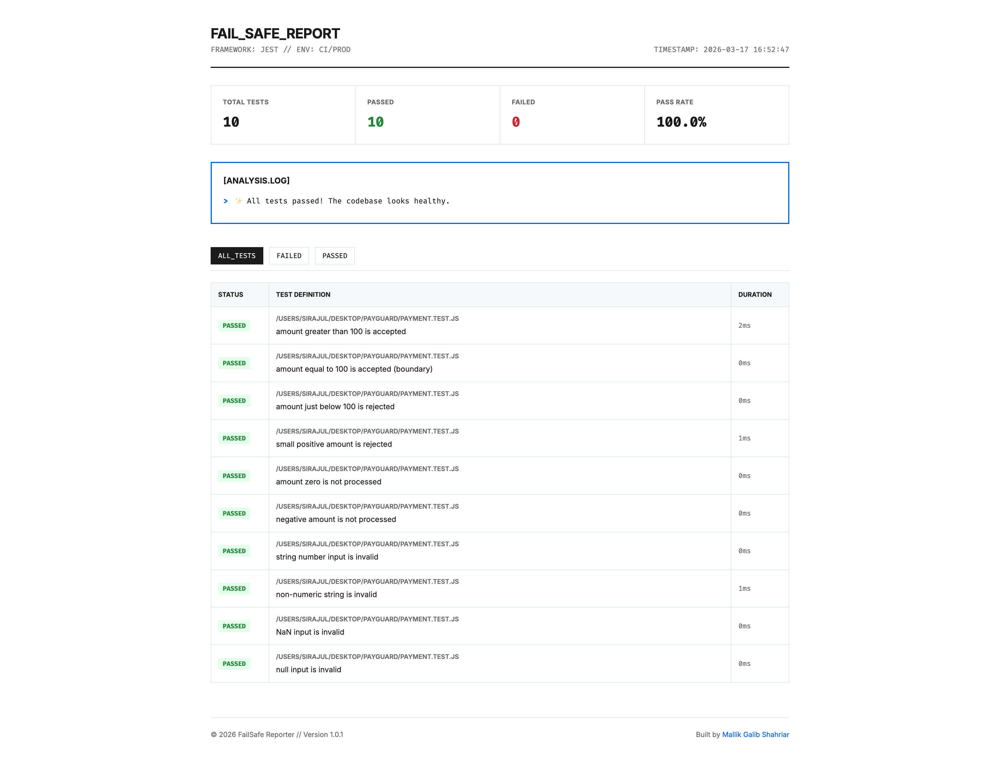
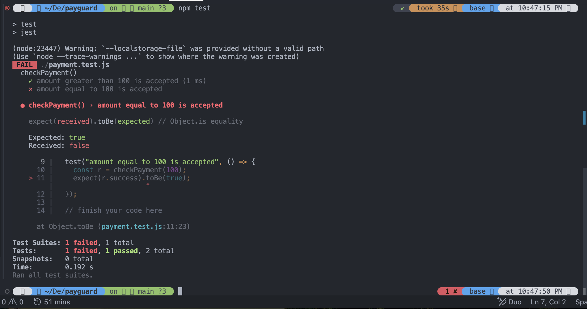
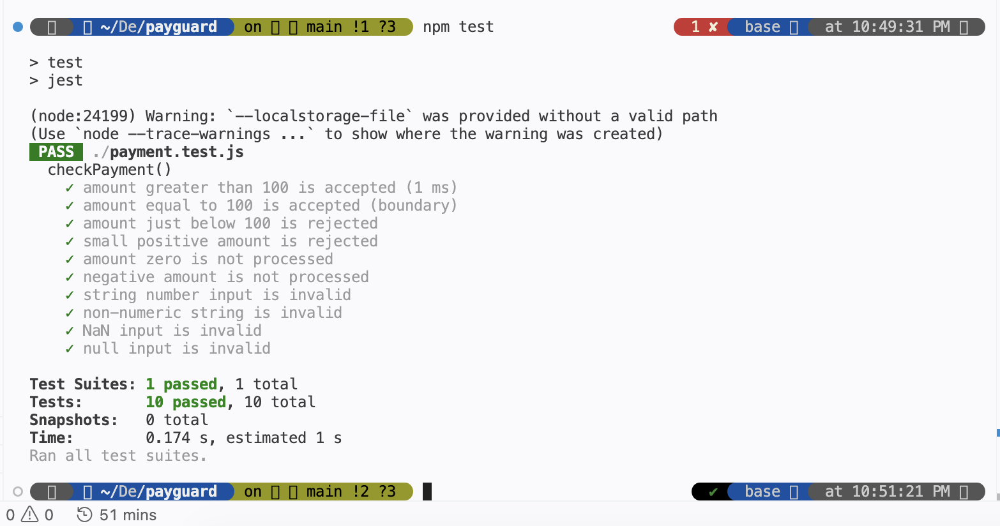

# PayGuard

A Jest testing project demonstrating payment amount validation with comprehensive test coverage.

## Description

This project showcases a simple payment validation function implemented in Node.js, with extensive Jest tests covering various scenarios including:

- Valid payments (amounts ≥ 100)
- Invalid inputs (non-numbers, NaN, null)
- Boundary conditions (amount = 100)
- Business rule validations (amount ≤ 0, amount < 100)

The `checkPayment` function validates payment amounts based on these rules:

- Amount must be a valid number (not NaN)
- Amount must be greater than 0
- Payments are accepted only if the amount is 100 or greater
- Payments below 100 are rejected

## Installation

Clone the repository and install dependencies:

```bash
npm install
```

## Usage

The project includes a simple `checkPayment` function that can be tested:

```javascript
const checkPayment = require("./payment");

const result = checkPayment(150);
console.log(result);
// { success: true, message: "Payment accepted" }

const result2 = checkPayment(50);
console.log(result2);
// { success: false, message: "Payment rejected" }
```

## Testing

Run the comprehensive test suite using Jest:

```bash
npm test
```

The test suite includes 10 test cases covering all validation scenarios and edge cases.

The tests cover various scenarios including valid payments, invalid inputs, and boundary conditions.

## Reports

After running tests, HTML and JSON reports are generated:
- `report.html`: Visual test report
- `results.json`: JSON test results



## Screenshots

### Before


### After


## Dependencies

- Jest: For testing
- @mallikgalibshahriar/failsafe-report: For generating test reports
